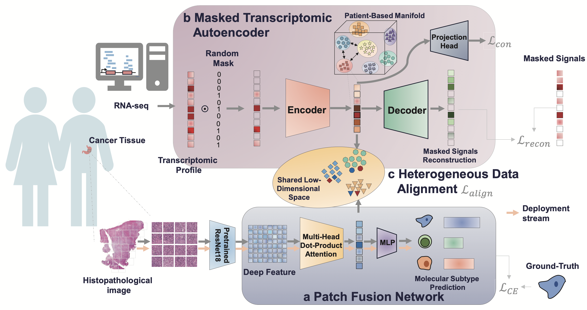

## Overview of TEMI (<u>***T***</u>ranscriptomic <u>***E***</u>xpression from <u>***M***</u>orphological <u>***I***</u>mages)



## Installation

```
cd /TEMI 
pip install -e .
```

Note that we ran our experiments with python 3.7.3.

## Usage

#### Command

* `temi-apr`: Run TEMI w/ APR (<u>***A***</u>lignment by <u>***P***</u>artial <u>***R***</u>econstruction)
* `temi-aod`: Run TEMI w/AOD (<u>***A***</u>lignment by <u>***o***</u>rthogonal <u>***D***</u>ecomposition)
* `temi-aodpr`: Run TEMI w/ AOD+APR.

#### Key arguments 

* `--proj`: project(chosen from CRC-DX/STAD-DX/GBM-DX)
* `--plr`:  learning rate of PFN (<u>***P***</u>atch <u>***F***</u>usion <u>***N***</u>etwork)
* `--elr`: learning rate of  MAT (<u>***M***</u>asked <u>***T***</u>ranscriptomic <u>***A***</u>utoencoder)
* `--transcriptomic_root`: the parent folder of the `transcriptomic` direcotry
* `--wsi_root`: the parent folder of the `postdata` directory

#### Examples

##### run TEMI with alignment by partial reconstruction.

```unix
temi-apr --proj CRC-DX --num_epochs 15 --plr 1e-3 --elr 1e-3 --smoothing 0.05 --transcriptomic_root . --wsi_root .
temi-apr --proj STAD-DX --num_epochs 25 --plr 1e-3 --elr 1e-3 --smoothing 0.1 --transcriptomic_root . --wsi_root .
temi-apr --proj GBM-DX --num_epochs 50 --plr 5e-3 --elr 5e-3 --smoothing 0.01 --transcriptomic_root . --wsi_root .
```

##### run TEMI with alignment by orthogonal decomposition and partial reconstruction.

```
temi-aodpr --proj CRC-DX  --num_epochs 15 --plr 1e-3 --elr 1e-3 --smoothing 0.05 --transcriptomic_root . --wsi_root .
temi-aodpr --proj STAD-DX --num_epochs 25 --plr 1e-3 --elr 1e-3 --smoothing 0.1 --transcriptomic_root . --wsi_root .
temi-aodpr --proj GBM-DX --num_epochs 50 --plr 5e-3 --elr 5e-3 --smoothing 0.01 --transcriptomic_root . --wsi_root .
```

##### run TEMI with alignment by orthogonal decomposition.

```
temi-aod --proj CRC-DX --plr 1e-3 --elr 1e-3 --num_epochs 15 --smoothing 0.05 --transcriptomic_root . --wsi_root .
temi-aod --proj STAD-DX --plr 1e-3 --elr 1e-3 --num_epochs 15 --smoothing 0.1 --transcriptomic_root . --wsi_root .
temi-aod --proj GBM-DX --plr 1e-3 --elr 1e-3 --num_epochs 50 --smoothing 0.01 --transcriptomic_root . --wsi_root .
```

## Postprocessed whole-slide-image datasets

The `postdata` directory can be downloaded from https://pan.baidu.com/s/1e-pwRb4cFqAKQL03P4FNZg?pwd=rnyw [password: rnyw].

## Slide toolbox

We also provide a MATLAB toolbox `TileSlideToolbox` for tiling slides into patches. [**OpenSlide**](https://github.com/openslide/openslide-winbuild/releases/download/v20171122/openslide-win64-20171122.zip) must be installed beforehand.

 The strcuture of `WSIDir` should be

```
/SVS/
|-- Subfold/
|	  |-- sampleID_somthing.svs
```

in `run_openslide_tile_WSI.m`. The size of patches is indicated by `tileSize`.

The result of patches of slides are stored in the `outDir` with structures

```
/outDir/valid
|-- sampleID/
|		|-- sampleID_x_y.svs
```

and 

```
/outDir/filter
|-- sampleID/
|		|-- sampleID_x_y.png
```

The non-informative regions are filtered by the Otsu’s method and stored in the `filter` directory. The location of a patch in a slide is indicated by the suffix of its filename (x, y), and slides can be reconstructed from patches using `reconstructWSI.m`.
